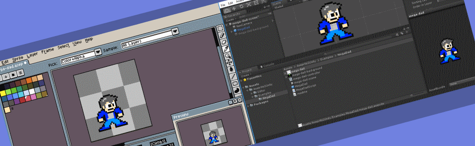

Aseprite2Unity Documentation
==========================================

.. figure:: img/mega-dad-stand.png
   :alt: Mega Dad (aka Sean Barton)

   By `Sean Barton <http://www.seanba.com>`_

**Aseprite2Unity** is a collection of Unity scripts that import files from the `Aseprite Animated Sprite Editor & Pixel Art Tool <https://www.aseprite.org/>`_ into your Unity projects.

The goal of Aseprite2Unity is to **seamlessly get sprite assets into Unity**. Need to make changes to your sprite animations? No problem! **Just make edits to your sprite in
Aseprite and resave.** That's it.

Aseprite2Unity will perform the following tasks for you, automatically, when (re)importing an Aseprite file:
  
 - Create `Unity Sprites <https://docs.unity3d.com/Manual/Sprites.html>`_ for each frame of animation (all blending modes supported)
 - Create `Animation Clips <https://docs.unity3d.com/Manual/AnimationClips.html>`_, grouped by `Frame Tags <https://imgur.com/t3ZGRzw>`_
 - Register sprite textures with a `Sprite Atlas <https://docs.unity3d.com/Manual/class-SpriteAtlas.html>`_ (optional)
 - Attach an `Animation Controller Asset <https://docs.unity3d.com/Manual/Animator.html>`_ (optional)
 - Result is a prefab with `SpriteRenderer <https://docs.unity3d.com/ScriptReference/SpriteRenderer.html>`_ and `Animator <https://docs.unity3d.com/Manual/class-Animator.html>`_ components filled out.

With Aseprite2Unity **you no longer need to fuss with Unity's Animation View** every time you make a change to your sprite animations - **a huge time saver**!

Aseprite2Unity is `distibuted as a Unity Package <https://seanba.itch.io/aseprite2unity>`_ at any price you choose (including free).
Additional `donations can be made <http://www.seanba.com/donate>`_ and **are always appreciated**.

.. toctree::
   :maxdepth: 2
   :caption: User Manual:

   manual/importer-options
   manual/sprite-pivots
   manual/sprite-animations
