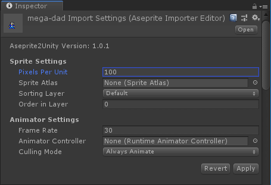

Importer Options
=========================

The Aseprite Importer Editor has a collection of settings that control how an Aseprite asset is imported.

+-----------------------------------------------------------------------------------------------------------+ 
| Sprite Settings                                                                                           | 
+=====================+=====================================================================================+ 
| **Pixels Per Unit** | This value is the amount of pixels that make up one unit of the Scene.              | 
+---------------------+-------------------------------------------------------------------------------------+ 
| **Sprite Atlas**    | (Optional) Imported Unity Sprites will be automatically added to this sprite atlas. | 
+---------------------+-------------------------------------------------------------------------------------+ 
| **Sorting Layer**   | SpriteRenderer will have this sorting layer assigned to it.                         | 
+---------------------+-------------------------------------------------------------------------------------+ 
| **Order in Layer**  | SpriteRenderer will have this order within the sorting layer.                       | 
+---------------------+-------------------------------------------------------------------------------------+ 
  
  
  
+----------------------------------------------------------------------------------------------------------------+ 
| Sprite Settings                                                                                                | 
+==========================+=====================================================================================+ 
| **Frame Rate**           | How often you want your sprite animations sampled. In frames-per-second.            | 
+--------------------------+-------------------------------------------------------------------------------------+ 
| **Animation Controller** | (Optional) Animator component will use this animation controller.                   | 
+--------------------------+-------------------------------------------------------------------------------------+ 
| **Culling Mode**         | Animator component will use this culling mode.                                      | 
+--------------------------+-------------------------------------------------------------------------------------+ 

