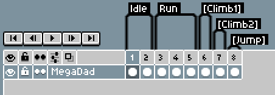
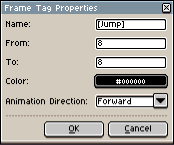

Sprite Animations
=================

Aseprite2Unity produces animation clips that are grouped by frame tags.

Animation clips are set to loop by default. If you want an animation to disable looping then make sure the frame tag name is surrounded by square brackets.

In other words, :code:`Jump` will be a looping animation whereas :code:`[Jump]` will not loop.

