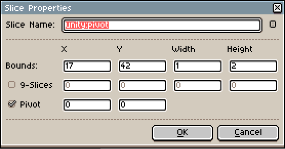

Sprite Pivots
=============

By default, Aseprite2Unity sets the pivot of your imported sprite at the center of your canvas.

**Overriding the sprite pivot point is simple.** Just add a "Pivot Slice" to your Aseprite file on the first frame named :code:`unity:pivot`.

.. tip:: Note that the **center of the pivot slice** is where the pivot point is placed.
   You may want to use a width or height of 2 in order to have pixel-perfect pivots.
